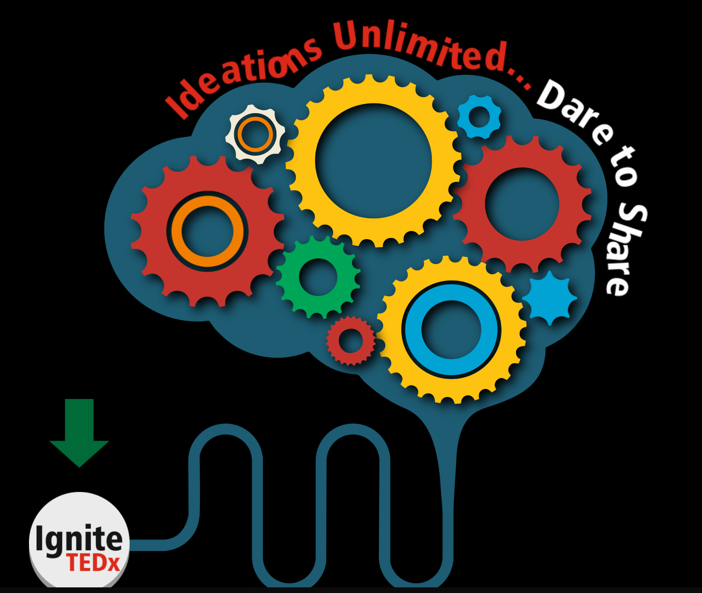

# Brain-Gears-UI
This is fancy user interface I created in one of my independent projects. A mix of HTML+CSS+JavaScript+jQuery, heavy on animation. Good for beginners to try out various animation effects.

As per the requirements of the projects I was working on, it is designed only for desktop screens. Though it makes use of Twitter Bootstrap, it it is not really a responsive design.

This has been used for a website promoting an independent TEDx event in Pune, India.
More details - <a href="http://tedxsiulavale.sitm.ac.in/" target="blank">http://tedxsiulavale.sitm.ac.in/</a>

</img>
